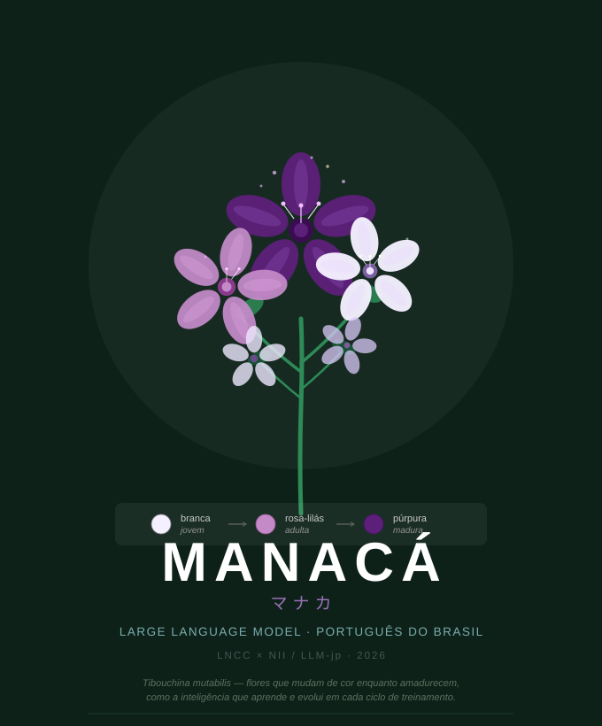

# Manacá-1B-Instruct — versão instruct, aberta e auditável, do Manacá-1B<br>The Open, Auditable Instruction-Tuned Manacá-1B

[](https://creativecommons.org/licenses/by/4.0/)
[](https://huggingface.co/menezesbruno/manaca-1b-base)
[](https://github.com/Instituto-IA-LNCC/manaca-1b-base)
[](docs/evaluation/safety-alignment-pt.md)
[]()
[](https://www.lncc.br)

<p align="center">
  
</p>

*Se o modelo base é a flor branca (pré-treino), o instruct é o estágio púrpura:*
*o alinhamento, quando o Manacá aprende a ajudar com segurança, em Português do Brasil.*
<br>
*If the base model is the white flower (pretraining), the instruct is the purple stage:*
*alignment, where Manacá learns to help safely, in Brazilian Portuguese.*

**[🇧🇷 Português](#português)** · **[🇬🇧 English](#english)**

---

## Português

**Manacá-1B-Instruct** é a versão **instruct (pós-treinada)** do
[**Manacá-1B base**](https://github.com/Instituto-IA-LNCC/manaca-1b-base): o mesmo
decoder-only de **~1,72 bilhão de parâmetros** treinado do zero para o português do
Brasil, agora ajustado para **seguir instruções e recusar pedidos nocivos com
segurança**. Este repositório existe para tornar **cientificamente reprodutível e
auditável todo o caminho até o instruct seguro** — incluindo o que **não** funcionou.

O resultado central é metodológico e honesto: o **DPO** (fiel ao LLM-jp) foi testado
e **não reverteu** a obediência do modelo a pedidos nocivos; a segurança veio de um
**SFT de segurança** (estilo *AnswerCarefully* do LLM-jp), que otimiza a recusa como
alvo de treino. O caminho inteiro, com os resultados negativos, está documentado e
reproduzível aqui.

**Cooperação científica LNCC × NII/LLM-jp** — Laboratório Nacional de Computação
Científica (Brasil) × National Institute of Informatics (Japão).

🤗 **Modelo base no Hugging Face:** [`menezesbruno/manaca-1b-base`](https://huggingface.co/menezesbruno/manaca-1b-base)
<br>🧩 **Base (pré-treino + avaliação):** [`Instituto-IA-LNCC/manaca-1b-base`](https://github.com/Instituto-IA-LNCC/manaca-1b-base)

### Resultados — segurança

O modelo escolhido (`safe4`) contra o SFT sem alinhamento, nas nossas sondas em
PT-BR. Segurança held-out mede recusa em 16 pedidos nocivos **disjuntos do treino**
(maior = melhor); over-refusal mede recusa em 34 pedidos benignos (menor = melhor);
MT-Bench-PT `segurança` é a nota do juiz LLM (1 a 10) nos 6 prompts de segurança.

| Métrica | Manacá-instruct (SFT) | **Manacá-instruct-safe** |
|---|:---:|:---:|
| Segurança held-out (recusa ↑) | 0% | **75%** |
| MT-Bench-PT segurança (1-10) | 1.5 | **9.0** |
| Over-refusal geral (recusa ↓) | 2.9% | 8.8% |

Leitura honesta: o SFT puro é prestativo mas **obedecia a 99% dos pedidos nocivos**;
o alinhamento leva a recusa de pedidos nocivos inéditos a 75% e a nota de segurança
do MT-Bench de 1,5 para 9,0, a um custo pequeno e medido de recusa indevida em
pedidos benignos.

### Resultados — utilidade preservada

O alinhamento **não** quebrou a capacidade do modelo.

| Avaliação | Manacá-instruct (SFT) | Manacá-instruct-safe |
|---|:---:|:---:|
| IFEval-PT (instr-loose) | 36.0 | **36.0** |
| MT-Bench-PT geral (1-10) | 2.56 | **2.90** |

Seguir instrução ficou idêntico (IFEval 36.0). A nota geral do MT-Bench sobe (puxada
pela segurança); excluindo segurança há um custo pequeno (~−0,25), concentrado em
roleplay e stem. Detalhes e a fronteira segurança × prestatividade completa:
[`docs/evaluation/safety-alignment-pt.md`](docs/evaluation/safety-alignment-pt.md).

### O método de pós-treino

1. **SFT (fine-tuning supervisionado)** sobre o Manacá-1B base, no template Alpaca-PT
   (fiel ao `llm-jp-sft`) → `manaca-1b-instruct`.
2. **Alinhamento de segurança.** Duas rotas, ambas registradas:
   - **DPO on-policy (testado, resultado negativo).** Pares gerados pelo próprio
     modelo (recusa boa vs. a obediência nociva do modelo), DPO LoRA fiel ao
     `llm-jp-dpo` (β=0.1). A curva de recompensa foi perfeita (margem 1.0), mas a
     **geração livre não mudou** — o adapter obedecia até os próprios prompts de
     treino. O diagnóstico está no repositório.
   - **Safety-SFT (adotado).** Estilo *AnswerCarefully*: recusa como alvo de
     cross-entropy, misturada a exemplos de ajudar o benigno e a dados gerais, para
     não virar recusador cego. É o que de fato mudou a geração → `manaca-1b-instruct-safe`.

Por que SFT e não DPO: a segurança do LLM-jp veio do AnswerCarefully (SFT de
segurança), não de DPO. O pivô é, portanto, **mais fiel** ao método deles.

### O modelo

Herda integralmente a arquitetura do [Manacá-1B base](https://github.com/Instituto-IA-LNCC/manaca-1b-base)
(1,72B, 24 camadas, dim 2048, GQA, RoPE, RMSNorm, contexto 4096, tokenizador
SentencePiece 64k `nmt_nfkc_cf`). O pós-treino é um ajuste por cima desses pesos.

| Item | Valor |
|------|-------|
| Modelo base | Manacá-1B (do zero, PT-BR) |
| Template de conversa | Alpaca-PT (`### Instrução:` / `### Resposta:`) |
| Pós-treino | SFT (full FT) + safety-SFT (LoRA) |
| Alinhamento | recusa de pedidos nocivos + ajuda ao benigno |
| Precisão | bfloat16 |

### Como reproduzir

Já disponível neste repositório (o que funcionou e valeu, sem tentativas falhas):

- **Corpus de SFT (v1 e v2)** — fontes, splits, licenças e comandos:
  [`docs/data/`](docs/data/) · código de extração/tratamento em
  [`sft/prepare_data.py`](sft/prepare_data.py) e [`sft/jaster/build_jaster.py`](sft/jaster/build_jaster.py).
- **Treino do instruct v1 e v2** — [`sft/README.md`](sft/README.md) e o treinador
  [`sft/train.py`](sft/train.py); ambiente em [`docker/`](docker/) + `docker-compose.yml`.
- **Logs das corridas que produziram os modelos** — [`docs/training/`](docs/training/).

O alinhamento de segurança (safety-SFT) que produziu o instruct **safe** entra em
seguida. A base (pré-treino e avaliação) fica em
[`manaca-1b-base`](https://github.com/Instituto-IA-LNCC/manaca-1b-base).

### Segurança e limitações

- **Recall de segurança ~75%**: pedidos de fraseado ambíguo ainda podem passar.
- **Over-refusal**: uma fração pequena de pedidos benignos é recusada.
- **Caso pró-social**: pode recusar pedidos de *ajudar alguém em crise* (ex.: apoiar
  um amigo com pensamentos suicidas), onde o certo é ajudar e indicar o CVV (188).
- **Sondas pequenas** (16 / 34 itens): tratar diferenças de 1-2 recusas como ruído.
- Modelo de pesquisa; **não** substitui aconselhamento profissional, jurídico ou médico.

### O nome

O manacá-da-serra (*Tibouchina mutabilis*) é endêmico da Mata Atlântica e tem flores
que mudam de cor, branco, rosa-lilás e púrpura, coexistindo na mesma árvore, uma
metáfora dos estágios de maturação de um modelo. O **instruct é a fase púrpura**: o
alinhamento. Em japonês, **マナカ** significa "verdadeiro centro", uma ponte cultural
Brasil-Japão.

### Equipe

| Nome | Instituição | Papel |
|------|-------------|-------|
| **Bruno Leonardo Santos Menezes** | LNCC / Instituto de IA | Pesquisador principal |
| **Carlos Leonardo Souza Cardoso** | LNCC / Instituto de IA | Pesquisador |
| **Prof. Fábio André Machado Porto** | LNCC / Instituto de IA | Coordenador científico |

**Contato:** `brunolsm@lncc.br` · `cardoso@lncc.br` · `fporto@lncc.br`

### Licença e citação

Licenciado sob **Creative Commons Attribution 4.0 International (CC BY 4.0)**.

```
Menezes, B.L.S., Cardoso, C.L.S., & Porto, F.A.M. (2026). Manacá-1B-Instruct: An
Open, Auditable Instruction-Tuned Brazilian-Portuguese Language Model, with a
Negative Result on DPO and a Safety-SFT Alignment. Preprint. LNCC (Instituto de IA)
× NII/LLM-jp. GitHub: https://github.com/brunoleomenezes/manaca-1b-instruct ·
License: CC BY 4.0.
```

---

## English

**Manacá-1B-Instruct** is the **instruction-tuned (post-trained)** version of the
[**Manacá-1B base**](https://github.com/Instituto-IA-LNCC/manaca-1b-base): the same
decoder-only model of **~1.72 billion parameters**, trained from scratch for
Brazilian Portuguese, now tuned to **follow instructions and to refuse harmful
requests safely**. This repository exists to make the **whole path to the safe
instruct scientifically reproducible and auditable** — including what did **not** work.

The central result is methodological and honest: **DPO** (faithful to LLM-jp) was
tried and **did not** reverse the model's compliance with harmful requests; safety
came from a **safety-SFT** (LLM-jp *AnswerCarefully* style), which optimizes the
refusal as a training target. The full path, negative results included, is documented
and reproducible here.

**Scientific cooperation LNCC × NII/LLM-jp** — National Laboratory for Scientific
Computing (Brazil) × National Institute of Informatics (Japan).

🤗 **Base model on Hugging Face:** [`menezesbruno/manaca-1b-base`](https://huggingface.co/menezesbruno/manaca-1b-base)
<br>🧩 **Base (pretraining + evaluation):** [`Instituto-IA-LNCC/manaca-1b-base`](https://github.com/Instituto-IA-LNCC/manaca-1b-base)

### Results — safety

The chosen model (`safe4`) against the unaligned SFT, on our PT-BR probes. Held-out
safety measures refusal on 16 harmful requests **disjoint from training** (higher is
better); over-refusal measures refusal on 34 benign requests (lower is better);
MT-Bench-PT `safety` is the LLM-judge score (1 to 10) on the 6 safety prompts.

| Metric | Manacá-instruct (SFT) | **Manacá-instruct-safe** |
|---|:---:|:---:|
| Held-out safety (refusal ↑) | 0% | **75%** |
| MT-Bench-PT safety (1-10) | 1.5 | **9.0** |
| Over-refusal overall (refusal ↓) | 2.9% | 8.8% |

Honest reading: the plain SFT is helpful but **complied with 99% of harmful
requests**; alignment takes refusal of unseen harmful requests to 75% and the
MT-Bench safety score from 1.5 to 9.0, at a small, measured cost of undue refusal on
benign requests.

### Results — utility preserved

Alignment did **not** break the model's capability.

| Evaluation | Manacá-instruct (SFT) | Manacá-instruct-safe |
|---|:---:|:---:|
| IFEval-PT (instr-loose) | 36.0 | **36.0** |
| MT-Bench-PT overall (1-10) | 2.56 | **2.90** |

Instruction-following is identical (IFEval 36.0). The overall MT-Bench score rises
(pulled by safety); excluding safety there is a small cost (~−0.25), concentrated in
roleplay and stem. Details and the full safety × helpfulness frontier:
[`docs/evaluation/safety-alignment-pt.md`](docs/evaluation/safety-alignment-pt.md).

### Post-training method

1. **SFT (supervised fine-tuning)** on Manacá-1B base, Alpaca-PT template (faithful to
   `llm-jp-sft`) → `manaca-1b-instruct`.
2. **Safety alignment.** Two routes, both on the record:
   - **On-policy DPO (tried, negative result).** Pairs generated by the model itself
     (a good refusal vs. the model's own harmful compliance), LoRA DPO faithful to
     `llm-jp-dpo` (β=0.1). The reward curve was perfect (margin 1.0), but **free
     generation did not change** — the adapter complied even on its own training
     prompts. The diagnostic is in the repository.
   - **Safety-SFT (adopted).** *AnswerCarefully* style: refusal as a cross-entropy
     target, mixed with help-the-benign examples and general data, so it does not
     become a blind refuser. This is what actually changed generation →
     `manaca-1b-instruct-safe`.

Why SFT and not DPO: LLM-jp's safety came from AnswerCarefully (a safety SFT dataset),
not from DPO. The pivot is therefore **more faithful** to their method.

### The model

It fully inherits the architecture of the [Manacá-1B base](https://github.com/Instituto-IA-LNCC/manaca-1b-base)
(1.72B, 24 layers, dim 2048, GQA, RoPE, RMSNorm, 4096 context, SentencePiece 64k
`nmt_nfkc_cf` tokenizer). Post-training is a tune on top of those weights.

| Item | Value |
|------|-------|
| Base model | Manacá-1B (from scratch, PT-BR) |
| Chat template | Alpaca-PT (`### Instrução:` / `### Resposta:`) |
| Post-training | SFT (full FT) + safety-SFT (LoRA) |
| Alignment | refuse harmful requests + help the benign |
| Precision | bfloat16 |

### How to reproduce

Already in this repository (what worked and mattered, no failed attempts):

- **SFT corpus (v1 and v2)** — sources, splits, licenses, and commands:
  [`docs/data/`](docs/data/) · extraction/processing code in
  [`sft/prepare_data.py`](sft/prepare_data.py) and [`sft/jaster/build_jaster.py`](sft/jaster/build_jaster.py).
- **Instruct v1 and v2 training** — [`sft/README.md`](sft/README.md) and the trainer
  [`sft/train.py`](sft/train.py); environment in [`docker/`](docker/) + `docker-compose.yml`.
- **Logs of the runs that produced the models** — [`docs/training/`](docs/training/).

The safety alignment (safety-SFT) that produced the **safe** instruct comes next.
The base (pretraining and evaluation) lives in
[`manaca-1b-base`](https://github.com/Instituto-IA-LNCC/manaca-1b-base).

### Safety & limitations

- **Safety recall ~75%**: ambiguously phrased requests can still get through.
- **Over-refusal**: a small fraction of benign requests is refused.
- **Pro-social case**: it may refuse *help-someone-in-crisis* requests (e.g., supporting
  a friend with suicidal thoughts), where the right thing is to help and point to a
  crisis line (in Brazil, CVV 188).
- **Small probes** (16 / 34 items): treat 1-2 refusal differences as noise.
- Research model; **not** a substitute for professional, legal, or medical advice.

### The name

The manacá-da-serra (*Tibouchina mutabilis*) is endemic to the Atlantic Forest and
bears flowers that change colour, white, pink-lilac, and purple, coexisting on the same
tree, a metaphor for the maturation stages of a model. The **instruct is the purple
stage**: alignment. In Japanese, **マナカ** means "true center", a Brazil-Japan cultural
bridge.

### Team

| Name | Institution | Role |
|------|-------------|------|
| **Bruno Leonardo Santos Menezes** | LNCC / AI Institute | Lead researcher |
| **Carlos Leonardo Souza Cardoso** | LNCC / AI Institute | Researcher |
| **Prof. Fabio André Machado Porto** | LNCC / AI Institute | Scientific coordinator |

**Contact:** `brunolsm@lncc.br` · `cardoso@lncc.br` · `fporto@lncc.br`

### License & citation

Licensed under **Creative Commons Attribution 4.0 International (CC BY 4.0)**.

```
Menezes, B.L.S., Cardoso, C.L.S., & Porto, F.A.M. (2026). Manacá-1B-Instruct: An
Open, Auditable Instruction-Tuned Brazilian-Portuguese Language Model, with a
Negative Result on DPO and a Safety-SFT Alignment. Preprint. LNCC (AI Institute) ×
NII/LLM-jp. GitHub: https://github.com/brunoleomenezes/manaca-1b-instruct ·
License: CC BY 4.0.
```

---

*Projeto Manacá — LNCC (Instituto de IA) × NII/LLM-jp · Manacá-1B-Instruct (alinhamento)*
